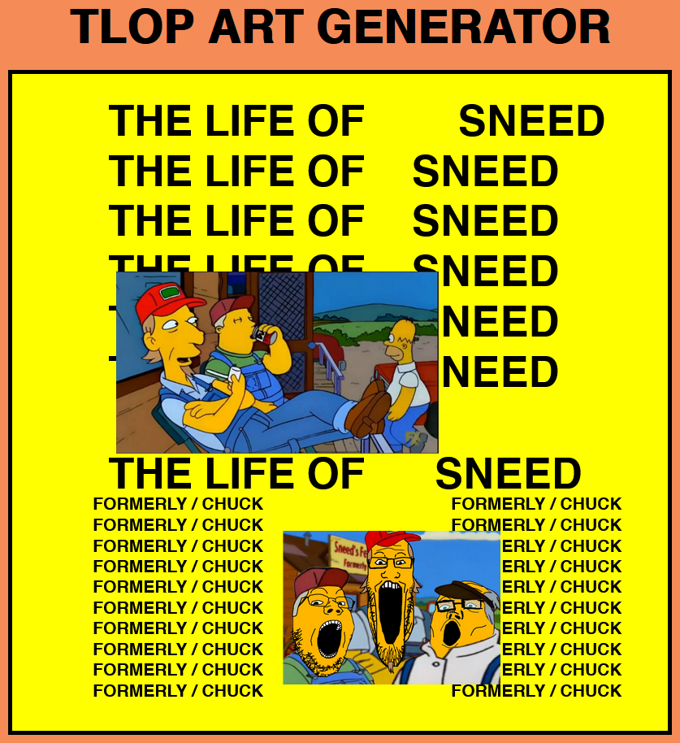

# TLoP Album Art Generator

Generates customisable images in the style of Kanye West's _The Life of Pablo_ album art.

Images are resized to the height of the original and centred on the centre of the original.

<https://tlop.xyl.sh>



## License

tlop-gen

Copyright (C) 2025 Xyl

This program is free software: you can redistribute it and/or modify it under the terms of the GNU Affero General Public License as published by the Free Software Foundation, either version 3 of the License, or (at your option) any later version.

This program is distributed in the hope that it will be useful, but WITHOUT ANY WARRANTY; without even the implied warranty of MERCHANTABILITY or FITNESS FOR A PARTICULAR PURPOSE. See the GNU Affero General Public License for more details.

You should have received a copy of the GNU Affero General Public License along with this program. If not, see <https://www.gnu.org/licenses/>.

```
SPDX-License-Identifier: AGPL-3.0-or-later
```

### Exceptions

- Files in the `src/resources/fonts/` and `src/resources/images/` directories are copyrighted and subject to their own license terms.
- Files in the `src/resources/icons/` directory are released as Creative Commons Zero (CC0-1.0) and can be considered public domain.
